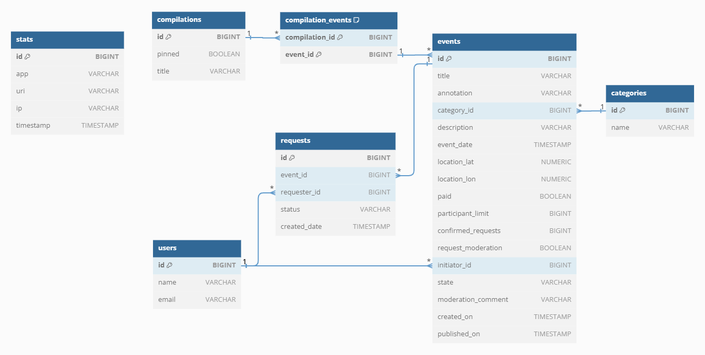

# java-explore-with-me project

Данный проект - сервис для шаринга (от англ. share — «делиться») вещей, он обеспечивает пользователям следующий функционал:
- делиться информацией об интересных событиях;
- находить компанию для участия в событиях.

Свободное время — ценный ресурс. Ежедневно мы планируем, как его потратить — куда и с кем сходить. Сложнее всего в таком планировании поиск информации и переговоры. Нужно учесть много деталей: какие намечаются мероприятия, свободны ли в этот момент друзья, как всех пригласить и где собраться.

# Технологии
Java, SpringBoot, REST API, Maven, Postgresql, Doker.

## Описание функционала
Приложение состоит из двух частей, которые общаются друг с другом через REST: 
- statistic;
- main. 

Запуск происходит через Docker. 
Statistic, main и БД PostgreSQL запускаются в отдельном Docker-контейнере как 
самостоятельное Java-приложение, а их взаимодействие настроено через Docker Compose.

> _Statistic_ собирает информацио:
> - количество обращений поьзователей к спискам событий;
> - количество запросов к подробной информации о событии.
> 
> _Main_ содержит контроллеры, с которыми непосредственно работают пользователи, вместе с валидацией входных данных.

## ФУНКЦИОНАЛ АДМИНИСТРАТОРА
### 1. **CategoryAdminController**:
   - ***POST /admin/categories*** - добавление новой категории.
   - ***DELETE /admin/categories/{catId}*** - удаление категории (удалить можно категорию, с которой не связаано ни одного события).
   - ***PATCH /admin/categories/{catId}*** - обновление категории.

### 2. **UserAdminController**:
   - ***GET /admin/users?from={from}&size={size}*** - получение информации о пользователях, подходящих под условие либо обо всех:
     - ids - список ID пользователей;
     - from - индекс первого элемента (для постраничного возврата значений, по умолчанию 0);
     - size - количество элементов для отображения страницы (для постраничного возрата значений, по умолчанию 10).
   - ***POST /admin/users*** - добавление нового пользователя.
   - ***DELETE /admin/users/{compId}*** - удаление пользователя.
     
### 3. **CompilationAdminController**:
   - ***POST /admin/compilations*** - добавление новой подборки (допускается без событий).
   - ***DELETE /admin/compilations/{compId}*** - удаление подборки.
   - ***PATCH /admin/compilations/{compId}*** - обновление подборки.

### 4. **EventAdminController**:
   - ***GET /admin/events?users={users}&statec={states}&categories={categories}&rangeStart={rangestart}&rangeEnd={rangeEnd}&from={from}&size={size}*** - получение информации обо всех событиях, подходящих под переданные условия:
     - users - список ID пользователей, чьи события надо найти;
     - states - список состояний, в которых находятся события;
     - categories - список ID категорий, в которых ищем события;
     - rangeStart - дата и время начала диапазона в границах которого ищутся события;
     - rangeEnd - дата и время окончания диапазона в границах которого ищутся события;
     - from - индекс первого элемента (для постраничного возврата значений, по умолчанию 0);
     - size - количество элементов для отображения страницы (для постраничного возрата значений, по умолчанию 10).
   - ***PATCH /admin/events/{eventId}*** - редактирование данных события и его статуса (отклонено / опубликовано). Дата начала события не ранее чем за час от даты публикации.
     Событие можно опубликовать, если оно в состоянии ожидания публикации. Событие можно отклонить, если оно еще не опубликовано.
     

## ФУНКЦИОНАЛ ПОЛЬЗОВАТЕЛЯ (ОТКРЫТАЯ ЧАСТЬ)
### 1. **CategoryPublicController**:
   - ***GET /categories?from={from}&size={size}*** - получение всех категорий, подходящих под переданные условия:
     - from - индекс первого элемента (для постраничного возврата значений, по умолчанию 0);
     - size - количество элементов для отображения страницы (для постраничного возрата значений, по умолчанию 10).
   - ***GET /categories/{catId}*** - получение конкретной категории по ID (при отсутствии категории с запрашиваемым ID выбрасывается ошибка 404).

### 2. **CompilationPublicController**:
   - ***GET /compilations?pinned={pinned}&from={from}&size={size}*** - получение подборок, подходящих под переданные условия:
     - pinned - поиск только закрепленных подборок (тип boolean);
	 - from - индекс первого элемента (для постраничного возврата значений, по умолчанию 0);
     - size - количество элементов для отображения страницы (для постраничного возрата значений, по умолчанию 10).
   - ***GET /compilations/{compId}*** - получение подборки событий по ID.

### 3. **EventPublicController**:
   - ***GET /events?text={text}&categories={categories}&paid={paid}&rangeStart={rangeStart}&rangeEnd={rangeEnd}&onlyAvailable={onlyAvailable}&sort={sort}&from={from}&size={size}*** - получение всех событий, подходящих под переданные условия:
     - text - текст для поиска в содержимом аннотации или описании события;
	 - categories - список ID категорий, в которых ищем события;
	 - paid - поиск осуществляется только для платных событий (тип boolean);
	 - rangeStart - дата и время начала диапазона в границах которого ищутся события;
     - rangeEnd - дата и время окончания диапазона в границах которого ищутся события;
	 - onlyAvailable - только события, на которые еще можно записаться (тип boolean);
	 - sort - сортировка по дате или количеству просмотров:
	   - EVENT_DATE;
	   - VIEWS.
     - from - индекс первого элемента (для постраничного возврата значений, по умолчанию 0);
     - size - количество элементов для отображения страницы (для постраничного возрата значений, по умолчанию 10).
   - ***GET /events/{id}*** - получение конкретной категории по ID (при отсутствии категории с запрашиваемым ID выбрасывается ошибка 404).

## ФУНКЦИОНАЛ ПОЛЬЗОВАТЕЛЯ (ЗАКРЫТАЯ ЧАСТЬ)
### 1. **EventPrivateController**:
   - ***GET users/{userId}/events?from={from}&size={size}*** - получение событий, добавленных текущим пользователем:
     - from - индекс первого элемента (для постраничного возврата значений, по умолчанию 0);
     - size - количество элементов для отображения страницы (для постраничного возрата значений, по умолчанию 10).
   - ***POST users/{userId}/events*** - добавление нового события.
   - ***GET users/{userId}/events/{eventId}*** - получение информации о событии, добавленном текущим пользователем.
   - ***PATCH users/{userId}/events/{eventId}*** - изменение события, добавленного текущим пользователем.
   - ***GET users/{userId}/events/{eventId}/requests*** - пролучение информации о запросах на участие в событии текущего пользователя.
   - ***PATCH users/{userId}/events/{eventId}/requests*** - изменение статуса (подтверждение / отмена) заявок на участие в событии текущего пользователя.

### 2. **RequestPrivateController**:
   - ***GET users/{userId}/requests*** - получение информации о заявках текущего пользователя на участие с чужих событиях.
   - ***POST users/{userId}/requests*** - добавление запроса от текущего пользователя на участие в событии.
   - ***PATCH users/{userId}/requests/{requestId}/cancel*** - отмена своего запроса на участие в событии.

   

## Описание базы данных
На диаграмме ниже представлен визуальный обзор базы данных Java-shareit и связей между таблицами.

Ниже приведен обзор таблиц базы данных:
- ***stats***: содержит данные по статистике.
- ***users***: содержит данные о пользователях.
- ***compilations***: содержит данные о подборках.
- ***compilation_events***: содержит данные о событиях в подборках.
- ***requests***: содержит данные о запросах участия пользователей на события .
- ***events***: содержит данные о событиях.
- ***categories***: содержит данные о категориях событий.

  

https://github.com/XpeHo3eM/java-explore-with-me/pull/6
